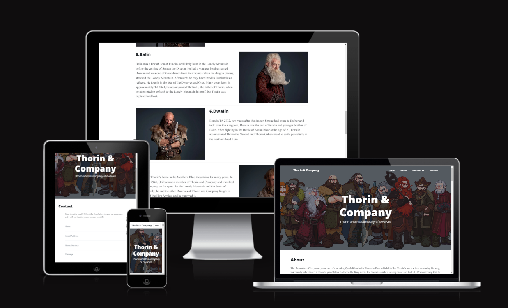

# Thorin Flask App

Walkthrough project using Python and Flask. This project was created using theme from [Startbootstrap](https://startbootstrap.com/theme/clean-blog). The theme was customised to the requirements of the project. The contact form is connected using http method POST. The name of the user who submitted the form is displayed back using message flashing from Flask. Some advanced routing was used to create individual pages for each character on the about page. 